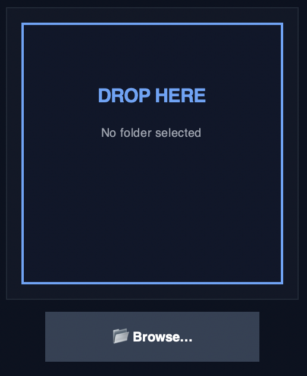
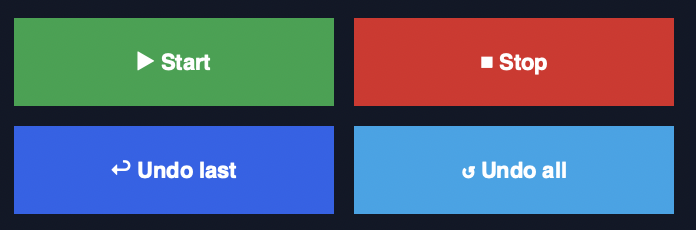
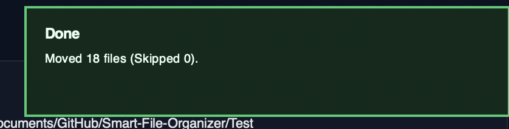

# Smart file organizer

## Description
The application automatically organizes files by their extension and creates appropriately named folders for each category. After identifying the file type, it moves each file into its corresponding folder, resulting in a clean and structured directory layout.

In addition to basic categorization, the app supports simple search within a selected folder and an optional recursive mode that scans and sorts files inside subfolders as well. It also includes a user-friendly GUI with drag-and-drop support, allowing users to quickly drop a folder into the interface and start organizing with minimal effort.

## Getting Started
There are two ways to run the application:

### 1) macOS app (`.app`)
- Download **Smart File Organizer.zip**
- Unzip the file
- Open the generated **.app** to launch the application directly on macOS

> **Note:** The macOS app saves the **logs** and **moves history** in the macOS **Application Support** directory, so it works like a proper standalone app and does **not** require local project folders for storing data.

---

### 2) Run from source (Python)
- Download (or clone) the full project folder
- Open a terminal in the project directory
- Run the GUI script:

```bash
python gui_win.py
# or
python3 gui_win.py
```

## User Interface Overview (Screenshots)


The application supports **drag-and-drop** functionality using the `tkinterdnd2` Python library and prompts the user to drop a folder into the designated area. Alternatively, users can select a folder manually via the **Browse** button.



On the right side of the interface, the **selected folder path** is displayed, along with an option to enable or disable **recursive** scanning (to include subfolders). The main controls include the buttons **Start**, **Stop**, **Undo Last**, and **Undo All**.



At the bottom of the window, the app displays **live statistics** about the sorting process, such as the number of files **moved**, **skipped**, and **scanned**. Finally, the **notification center** in the bottom-right corner shows real-time updates about file moves and other actions.

s

The app displays status notifications in the **top-right corner** of the window.  
These notifications inform you about:
- Successful folder organizing (sorting)
- Successful undo actions (undo last / undo all)
- Warnings or errors during the process

